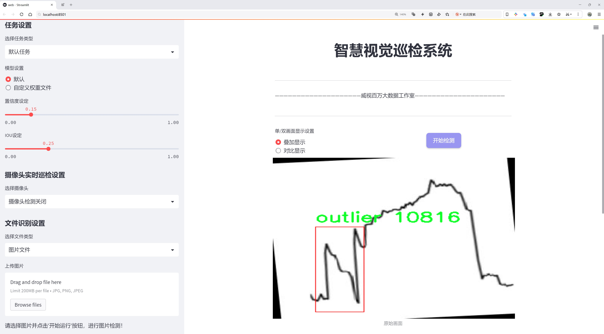
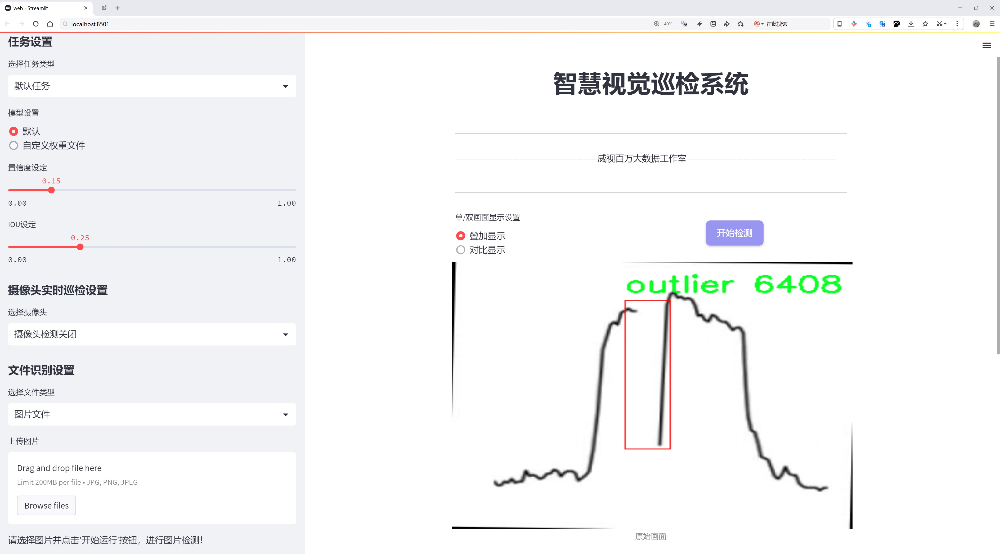
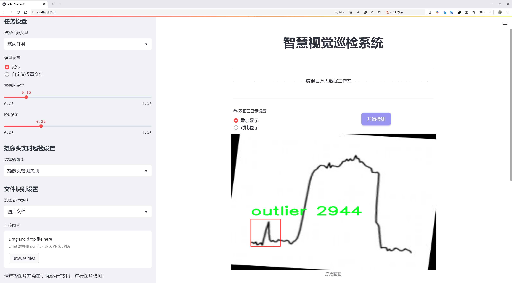
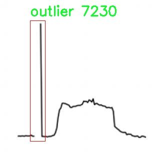
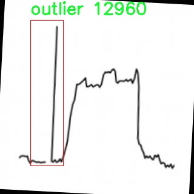
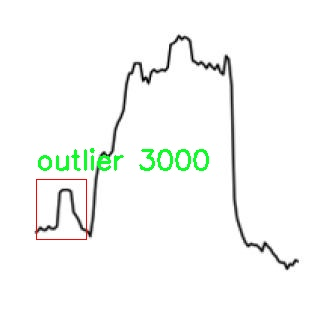
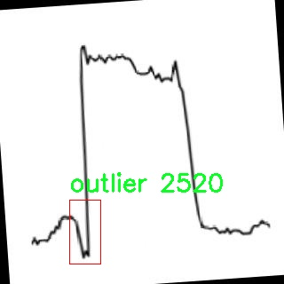
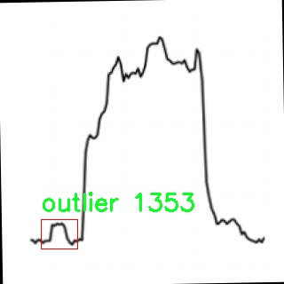

# 曲线图异常波形检测检测系统源码分享
 # [一条龙教学YOLOV8标注好的数据集一键训练_70+全套改进创新点发刊_Web前端展示]

### 1.研究背景与意义

项目参考[AAAI Association for the Advancement of Artificial Intelligence](https://gitee.com/qunmasj/projects)

项目来源[AACV Association for the Advancement of Computer Vision](https://kdocs.cn/l/cszuIiCKVNis)

研究背景与意义

随着信息技术的迅猛发展，数据驱动的决策过程在各个领域中变得愈发重要。尤其是在建筑能耗管理领域，如何有效地监测和分析能耗数据，已成为提升建筑能效和降低运营成本的关键因素。传统的能耗数据分析方法往往依赖于人工监测和简单的统计分析，难以应对复杂的能耗模式和突发的异常情况。因此，基于计算机视觉和深度学习技术的自动化异常检测系统应运而生，成为研究的热点。

YOLO（You Only Look Once）系列模型因其高效的实时目标检测能力而受到广泛关注。YOLOv8作为该系列的最新版本，结合了更先进的网络结构和优化算法，能够在保持高准确率的同时，实现更快的检测速度。然而，针对特定应用场景的改进和定制化仍然是提升模型性能的关键。特别是在建筑能耗数据的异常波形检测中，如何利用YOLOv8的特性，针对曲线图中的异常波形进行精准识别，成为了研究的主要方向。

本研究基于改进的YOLOv8模型，构建了一套专门用于曲线图异常波形检测的系统。该系统利用了来自“Vision-based-building-energy-data-outlier-detection”模块的数据集，包含2200张图像，专注于识别能耗数据中的异常值。数据集中仅有一个类别，即“outlier”，这使得模型的训练和评估更加集中，便于针对性地优化检测效果。通过对数据集的深入分析，我们发现异常波形往往呈现出与正常波形显著不同的特征，这为模型的训练提供了丰富的样本和明确的目标。

研究的意义不仅在于提升建筑能耗数据的异常检测能力，更在于推动智能建筑管理系统的发展。通过实现高效的异常检测，管理者能够及时识别并处理能耗异常，避免潜在的资源浪费和设备损坏。此外，基于YOLOv8的检测系统能够为建筑能耗数据的实时监控提供技术支持，促进数据驱动的决策制定，提升建筑的整体能效。

此外，本研究还具有一定的理论价值。通过对YOLOv8模型的改进和应用，我们可以探索深度学习在特定领域中的适用性和局限性，为后续的研究提供参考。同时，异常检测技术的进步也为其他领域的应用提供了借鉴，如交通监控、工业设备监测等，具有广泛的推广价值。

综上所述，基于改进YOLOv8的曲线图异常波形检测系统的研究，不仅为建筑能耗管理提供了新的解决方案，也为深度学习技术在实际应用中的发展开辟了新的方向。通过本研究，我们期望能够为智能建筑的可持续发展贡献一份力量，同时推动相关领域的技术进步。

### 2.图片演示







##### 注意：由于此博客编辑较早，上面“2.图片演示”和“3.视频演示”展示的系统图片或者视频可能为老版本，新版本在老版本的基础上升级如下：（实际效果以升级的新版本为准）

  （1）适配了YOLOV8的“目标检测”模型和“实例分割”模型，通过加载相应的权重（.pt）文件即可自适应加载模型。

  （2）支持“图片识别”、“视频识别”、“摄像头实时识别”三种识别模式。

  （3）支持“图片识别”、“视频识别”、“摄像头实时识别”三种识别结果保存导出，解决手动导出（容易卡顿出现爆内存）存在的问题，识别完自动保存结果并导出到tempDir中。

  （4）支持Web前端系统中的标题、背景图等自定义修改，后面提供修改教程。

  另外本项目提供训练的数据集和训练教程,暂不提供权重文件（best.pt）,需要您按照教程进行训练后实现图片演示和Web前端界面演示的效果。

### 3.视频演示

[3.1 视频演示](https://www.bilibili.com/video/BV1koxLegE6L/)

### 4.数据集信息展示

##### 4.1 本项目数据集详细数据（类别数＆类别名）

nc: 1
names: ['outlier']


##### 4.2 本项目数据集信息介绍

数据集信息展示

在现代建筑能耗管理和监测领域，异常波形检测技术正逐渐成为提高能效和降低运营成本的重要工具。本研究所采用的数据集名为“Vision-based-building-energy-data-outlier-detection”，专门用于训练和改进YOLOv8模型，以实现对建筑能耗数据中异常波形的精准检测。该数据集的设计旨在为研究人员和工程师提供一个高质量的基础，以便在实际应用中识别和处理能耗数据中的异常情况，从而优化建筑能耗管理策略。

该数据集的类别数量为1，具体类别为“outlier”，这意味着数据集中专注于识别和标记那些偏离正常能耗模式的异常数据点。通过对这些异常波形的分析，研究人员可以更好地理解建筑能耗的变化规律，并及时采取措施以避免潜在的能源浪费或设备故障。数据集的构建过程中，采集了大量的建筑能耗数据，涵盖了不同时间段和不同环境条件下的能耗表现。这些数据经过精心筛选和标注，确保了数据的准确性和代表性，为后续的模型训练提供了坚实的基础。

在数据集的具体构成上，虽然类别数量较少，但其丰富的样本量和多样的异常情况使得模型在训练过程中能够学习到不同类型的异常特征。这些特征不仅包括能耗波形的幅度变化，还涉及到时间序列中的突变、周期性波动等多种表现形式。通过对这些异常波形的深入分析，YOLOv8模型能够逐步掌握如何在复杂的能耗数据中有效识别出潜在的异常情况，从而提高检测的准确性和效率。

此外，数据集的设计也考虑到了实际应用中的多样性。虽然主要聚焦于“outlier”这一类别，但在数据采集过程中，研究团队确保涵盖了不同建筑类型、不同使用模式和不同气候条件下的能耗数据。这种多样性不仅提高了模型的泛化能力，也使得其在实际应用中能够适应更广泛的场景，满足不同用户的需求。

在模型训练过程中，数据集的使用将极大地推动YOLOv8在异常波形检测领域的性能提升。通过对大量标注数据的学习，模型将能够在实际应用中快速识别出异常波形，并提供相应的预警信息。这对于建筑管理者来说，无疑是一个重要的工具，能够帮助他们及时发现问题并采取相应的措施，从而有效降低能耗和维护成本。

综上所述，“Vision-based-building-energy-data-outlier-detection”数据集为改进YOLOv8的曲线图异常波形检测系统提供了强有力的支持。通过精心设计和丰富的数据样本，该数据集不仅提升了模型的训练效果，也为建筑能耗管理的智能化和自动化提供了新的可能性。未来，随着数据集的不断扩展和模型的持续优化，异常波形检测技术将在建筑能耗管理中发挥越来越重要的作用。











### 5.全套项目环境部署视频教程（零基础手把手教学）

[5.1 环境部署教程链接（零基础手把手教学）](https://www.ixigua.com/7404473917358506534?logTag=c807d0cbc21c0ef59de5)


[5.2 安装Python虚拟环境创建和依赖库安装视频教程链接（零基础手把手教学）](https://www.ixigua.com/7404474678003106304?logTag=1f1041108cd1f708b01a)

### 6.手把手YOLOV8训练视频教程（零基础小白有手就能学会）

[6.1 手把手YOLOV8训练视频教程（零基础小白有手就能学会）](https://www.ixigua.com/7404477157818401292?logTag=d31a2dfd1983c9668658)

### 7.70+种全套YOLOV8创新点代码加载调参视频教程（一键加载写好的改进模型的配置文件）

[7.1 70+种全套YOLOV8创新点代码加载调参视频教程（一键加载写好的改进模型的配置文件）](https://www.ixigua.com/7404478314661806627?logTag=29066f8288e3f4eea3a4)

### 8.70+种全套YOLOV8创新点原理讲解（非科班也可以轻松写刊发刊，V10版本正在科研待更新）

由于篇幅限制，每个创新点的具体原理讲解就不一一展开，具体见下列网址中的创新点对应子项目的技术原理博客网址【Blog】：


[8.1 70+种全套YOLOV8创新点原理讲解链接](https://gitee.com/qunmasj/good)

### 9.系统功能展示（检测对象为举例，实际内容以本项目数据集为准）

图9.1.系统支持检测结果表格显示

  图9.2.系统支持置信度和IOU阈值手动调节

  图9.3.系统支持自定义加载权重文件best.pt(需要你通过步骤5中训练获得)

  图9.4.系统支持摄像头实时识别

  图9.5.系统支持图片识别

  图9.6.系统支持视频识别

  图9.7.系统支持识别结果文件自动保存

  图9.8.系统支持Excel导出检测结果数据


### 10.原始YOLOV8算法原理

原始YOLOv8算法原理

YOLOv8算法是由Ultralytics公司于2023年发布的最新目标检测模型，作为YOLO系列的又一重要迭代，它在前一版本YOLOv7的基础上进行了多方面的优化和改进。YOLOv8不仅在精度和速度上实现了显著提升，还在模型结构上进行了创新，特别是对于不同场景需求的适应性增强，使其在智能监控、自动驾驶和人脸识别等应用中展现出卓越的性能。

首先，YOLOv8引入了C2f模块，这一模块的设计灵感来源于YOLOv5中的C3模块，但在结构上进行了优化。C2f模块通过增加残差连接，能够在轻量化的基础上获得更丰富的梯度信息，从而提高模型的学习能力和泛化能力。这种设计不仅提升了特征提取的效率，还增强了模型在复杂场景下的表现能力。C2f模块的引入，使得YOLOv8在特征提取阶段能够更好地捕捉到图像中的细节信息，从而提高了目标检测的精度。

在主干网络方面，YOLOv8采用了CSP（Cross Stage Partial）结构，将特征提取过程分为两部分，分别进行卷积和连接。这种分离的设计理念有效地减少了模型的计算复杂度，同时保持了特征的丰富性。CSP结构的应用，使得YOLOv8在处理大规模数据时，能够更高效地利用计算资源，从而提高了模型的整体性能。

YOLOv8在特征融合方面也做出了重要改进，采用了PAN-FPN（Path Aggregation Network - Feature Pyramid Network）结构。该结构通过多尺度特征融合，能够有效地结合不同层次的特征信息，从而提升目标检测的准确性。PAN-FPN的设计使得YOLOv8能够在不同尺度的目标检测中表现出色，尤其是在小目标的检测上，具有明显的优势。

值得注意的是，YOLOv8采用了Anchor-Free的检测方式，这一创新极大地简化了目标检测的过程。传统的Anchor-Based方法依赖于预定义的锚框，而YOLOv8通过解耦头结构，将分类和检测任务分离，使得模型能够直接在特征图上进行目标定位。这种方法不仅提高了检测的灵活性，还减少了模型的训练复杂度，使得YOLOv8在各种场景下都能快速适应。

在损失函数的设计上，YOLOv8也进行了优化，采用了BCELoss作为分类损失，DFLLoss和CIoULoss作为回归损失。这种组合损失函数的设计，能够更好地平衡分类和定位任务之间的关系，从而提升模型的整体性能。通过对损失函数的精细调整，YOLOv8在训练过程中能够更有效地学习到目标的特征信息，从而提高检测的准确性。

YOLOv8还在数据增强策略上进行了创新，特别是在训练的最后10个epoch中关闭了马赛克增强，并引入了动态Task-Aligned Assigner样本分配策略。这一策略的实施，使得模型在训练过程中能够更好地适应不同类型的样本，从而提高了模型的鲁棒性和泛化能力。

综上所述，YOLOv8算法通过多方面的创新和优化，显著提升了目标检测的精度和速度。其在模型结构、特征提取、损失函数和数据增强等方面的改进，使得YOLOv8在面对复杂场景时，能够更好地捕捉目标信息，进而实现高效的目标检测。随着YOLOv8的发布，目标检测技术的应用前景将更加广阔，尤其是在智能监控、自动驾驶等领域，YOLOv8无疑将成为一个强有力的工具，为相关应用提供更高效、更准确的解决方案。


### 11.项目核心源码讲解（再也不用担心看不懂代码逻辑）

#### 11.1 70+种YOLOv8算法改进源码大全和调试加载训练教程（非必要）\ultralytics\models\nas\__init__.py

下面是对给定代码的逐文件分析和核心部分的保留，以及详细的中文注释：

```python
# Ultralytics YOLO 🚀, AGPL-3.0 license

# 从当前包中导入 NAS 模型、预测器和验证器
from .model import NAS  # 导入 NAS 模型类
from .predict import NASPredictor  # 导入 NAS 预测器类
from .val import NASValidator  # 导入 NAS 验证器类

# 定义模块的公共接口，包含 NASPredictor、NASValidator 和 NAS
__all__ = 'NASPredictor', 'NASValidator', 'NAS'
```

### 代码分析

1. **导入模块**：
   - `from .model import NAS`：从当前包的 `model` 模块中导入 `NAS` 类，`NAS` 可能是一个神经网络模型的定义。
   - `from .predict import NASPredictor`：从当前包的 `predict` 模块中导入 `NASPredictor` 类，`NASPredictor` 可能用于对输入数据进行预测。
   - `from .val import NASValidator`：从当前包的 `val` 模块中导入 `NASValidator` 类，`NASValidator` 可能用于验证模型的性能。

2. **定义公共接口**：
   - `__all__ = 'NASPredictor', 'NASValidator', 'NAS'`：定义了模块的公共接口，表示当使用 `from module import *` 时，只会导入 `NASPredictor`、`NASValidator` 和 `NAS` 这三个类。这有助于控制模块的可见性，避免不必要的内部实现被外部访问。

### 核心部分
- 本代码的核心部分是导入模型、预测器和验证器，以及定义公共接口。这些部分是实现 YOLO（You Only Look Once）算法的基础，允许用户使用这些类进行模型的预测和验证。

这个文件是一个Python模块的初始化文件，位于Ultralytics YOLO项目的nas目录下。文件的主要功能是导入该模块中的一些核心类，并定义模块的公共接口。

首先，文件开头的注释部分标明了这是Ultralytics YOLO项目的一部分，并且使用了AGPL-3.0许可证，这意味着该代码是开源的，用户可以自由使用和修改，但需要遵循相应的许可证条款。

接下来，文件通过相对导入的方式引入了三个重要的类：`NAS`、`NASPredictor`和`NASValidator`。这些类分别定义在同一目录下的不同文件中。`NAS`类通常用于定义神经架构搜索（Neural Architecture Search）相关的模型结构，而`NASPredictor`和`NASValidator`则分别用于模型的预测和验证功能。

最后，`__all__`变量被定义为一个元组，包含了这三个类的名称。这一行代码的作用是明确指定当使用`from module import *`语句时，哪些名称会被导入。这是一个良好的编程习惯，可以帮助控制模块的公共接口，避免不必要的名称污染。

总体来说，这个文件的结构简单明了，主要是为了组织和管理YOLO项目中与神经架构搜索相关的功能模块。

#### 11.2 ui.py

```python
import sys
import subprocess

def run_script(script_path):
    """
    使用当前 Python 环境运行指定的脚本。

    Args:
        script_path (str): 要运行的脚本路径

    Returns:
        None
    """
    # 获取当前 Python 解释器的路径
    python_path = sys.executable

    # 构建运行命令，使用 streamlit 运行指定的脚本
    command = f'"{python_path}" -m streamlit run "{script_path}"'

    # 执行命令并等待其完成
    result = subprocess.run(command, shell=True)
    
    # 检查命令执行结果，如果返回码不为0，则表示出错
    if result.returncode != 0:
        print("脚本运行出错。")


# 主程序入口
if __name__ == "__main__":
    # 指定要运行的脚本路径
    script_path = "web.py"  # 这里可以直接指定脚本名，假设在当前目录下

    # 调用函数运行脚本
    run_script(script_path)
```

### 代码注释说明：
1. **导入模块**：
   - `sys`：用于获取当前 Python 解释器的路径。
   - `subprocess`：用于执行外部命令。

2. **`run_script` 函数**：
   - 该函数接收一个脚本路径作为参数，并使用当前 Python 环境运行该脚本。
   - 使用 `sys.executable` 获取当前 Python 解释器的路径。
   - 构建一个命令字符串，使用 `streamlit` 模块运行指定的脚本。
   - 使用 `subprocess.run` 执行命令，并等待其完成。
   - 检查命令的返回码，如果不为0，表示脚本运行出错，打印错误信息。

3. **主程序入口**：
   - 在 `if __name__ == "__main__":` 语句下，指定要运行的脚本路径（这里假设脚本名为 `web.py`）。
   - 调用 `run_script` 函数，传入脚本路径以执行。

这个程序文件的主要功能是使用当前的 Python 环境来运行一个指定的脚本，具体来说是一个名为 `web.py` 的脚本。程序首先导入了必要的模块，包括 `sys`、`os` 和 `subprocess`，这些模块提供了与系统交互和执行外部命令的功能。此外，还导入了 `abs_path` 函数，这个函数来自于 `QtFusion.path` 模块，用于获取文件的绝对路径。

在 `run_script` 函数中，首先获取当前 Python 解释器的路径，这样可以确保在正确的环境中运行脚本。接着，构建一个命令字符串，这个命令使用 `streamlit` 来运行指定的脚本。`streamlit` 是一个用于构建数据应用的框架，命令的格式是 `python -m streamlit run "script_path"`，其中 `script_path` 是要运行的脚本的路径。

随后，使用 `subprocess.run` 方法来执行这个命令。这个方法会在一个新的 shell 中运行命令，并等待其完成。如果命令执行后返回的状态码不为零，表示脚本运行过程中出现了错误，此时程序会打印出“脚本运行出错”的提示信息。

在文件的最后部分，使用 `if __name__ == "__main__":` 语句来确保只有在直接运行该文件时才会执行下面的代码。这里指定了要运行的脚本路径，调用 `abs_path` 函数获取 `web.py` 的绝对路径，并最终调用 `run_script` 函数来执行这个脚本。

总体来说，这个程序的结构简单明了，主要用于方便地在指定的 Python 环境中运行一个 Streamlit 应用脚本。

#### 11.3 code\ultralytics\utils\callbacks\clearml.py

以下是经过简化和注释的核心代码部分：

```python
# 导入必要的库
from ultralytics.utils import LOGGER, SETTINGS, TESTS_RUNNING

# 尝试导入 ClearML 库并进行基本的设置检查
try:
    assert not TESTS_RUNNING  # 确保不在测试环境中
    assert SETTINGS["clearml"] is True  # 确保 ClearML 集成已启用
    import clearml
    from clearml import Task
    from clearml.binding.frameworks.pytorch_bind import PatchPyTorchModelIO
    from clearml.binding.matplotlib_bind import PatchedMatplotlib

    assert hasattr(clearml, "__version__")  # 确保 ClearML 是有效的包

except (ImportError, AssertionError):
    clearml = None  # 如果导入失败，则将 clearml 设置为 None

def on_pretrain_routine_start(trainer):
    """在预训练例程开始时运行；初始化并连接/记录任务到 ClearML。"""
    try:
        task = Task.current_task()  # 获取当前任务
        if task:
            # 禁用自动的 PyTorch 和 Matplotlib 绑定
            PatchPyTorchModelIO.update_current_task(None)
            PatchedMatplotlib.update_current_task(None)
        else:
            # 初始化一个新的 ClearML 任务
            task = Task.init(
                project_name=trainer.args.project or "YOLOv8",  # 项目名称
                task_name=trainer.args.name,  # 任务名称
                tags=["YOLOv8"],  # 标签
                output_uri=True,
                reuse_last_task_id=False,
                auto_connect_frameworks={"pytorch": False, "matplotlib": False},  # 禁用自动连接
            )
            LOGGER.warning(
                "ClearML Initialized a new task. If you want to run remotely, "
                "please add clearml-init and connect your arguments before initializing YOLO."
            )
        task.connect(vars(trainer.args), name="General")  # 连接训练参数
    except Exception as e:
        LOGGER.warning(f"WARNING ⚠️ ClearML installed but not initialized correctly, not logging this run. {e}")

def on_train_epoch_end(trainer):
    """在 YOLO 训练的每个 epoch 结束时记录调试样本并报告当前训练进度。"""
    task = Task.current_task()  # 获取当前任务
    if task:
        if trainer.epoch == 1:  # 仅在第一个 epoch 记录调试样本
            _log_debug_samples(sorted(trainer.save_dir.glob("train_batch*.jpg")), "Mosaic")
        # 报告当前训练进度
        for k, v in trainer.label_loss_items(trainer.tloss, prefix="train").items():
            task.get_logger().report_scalar("train", k, v, iteration=trainer.epoch)
        for k, v in trainer.lr.items():
            task.get_logger().report_scalar("lr", k, v, iteration=trainer.epoch)

def on_train_end(trainer):
    """在训练完成时记录最终模型及其名称。"""
    task = Task.current_task()  # 获取当前任务
    if task:
        # 记录最终结果，包括混淆矩阵和 PR 曲线
        files = [
            "results.png",
            "confusion_matrix.png",
            "confusion_matrix_normalized.png",
            *(f"{x}_curve.png" for x in ("F1", "PR", "P", "R")),
        ]
        files = [(trainer.save_dir / f) for f in files if (trainer.save_dir / f).exists()]  # 过滤存在的文件
        for f in files:
            _log_plot(title=f.stem, plot_path=f)  # 记录图像
        # 报告最终指标
        for k, v in trainer.validator.metrics.results_dict.items():
            task.get_logger().report_single_value(k, v)
        # 记录最终模型
        task.update_output_model(model_path=str(trainer.best), model_name=trainer.args.name, auto_delete_file=False)

# 定义回调函数
callbacks = (
    {
        "on_pretrain_routine_start": on_pretrain_routine_start,
        "on_train_epoch_end": on_train_epoch_end,
        "on_train_end": on_train_end,
    }
    if clearml
    else {}
)
```

### 代码注释说明：
1. **导入库**：导入必要的库以支持 ClearML 和 YOLO 的功能。
2. **ClearML 初始化**：检查 ClearML 是否可用，并确保在非测试环境中运行。
3. **任务管理**：在训练开始时初始化或连接到 ClearML 任务，并记录训练参数。
4. **训练过程记录**：在每个 epoch 结束时记录训练进度和调试样本。
5. **训练结束处理**：在训练完成时记录最终模型及其相关结果，包括图像和指标。

这些核心部分和注释可以帮助理解代码的主要功能和流程。

这个程序文件是一个用于与ClearML集成的回调函数模块，主要用于在Ultralytics YOLO训练过程中记录和管理训练的相关信息。首先，文件通过导入必要的库和模块来设置环境，并检查ClearML的集成是否启用。如果没有成功导入ClearML或集成未启用，相关功能将无法使用。

文件中定义了一些辅助函数。`_log_debug_samples`函数用于将调试样本（通常是图像）记录到ClearML任务中。它接受文件路径列表和标题作为参数，遍历文件列表，提取文件名中的迭代信息，并将图像记录到当前任务的日志中。`_log_plot`函数则用于将图像作为绘图记录到ClearML的绘图部分，它会读取指定路径的图像并使用Matplotlib显示，随后将其记录到ClearML中。

接下来，文件定义了一系列回调函数，这些函数在特定的训练阶段被调用。`on_pretrain_routine_start`函数在预训练例程开始时运行，负责初始化和连接ClearML任务。如果当前没有任务，它会创建一个新的任务并连接训练参数。`on_train_epoch_end`函数在每个训练周期结束时被调用，记录调试样本并报告当前的训练进度。`on_fit_epoch_end`函数在每个周期结束时报告模型信息，包括验证损失和其他指标。`on_val_end`函数用于记录验证结果，包括标签和预测的图像。最后，`on_train_end`函数在训练完成时被调用，记录最终模型及其名称，并报告最终的评估指标。

在文件的最后，定义了一个回调字典，包含了上述所有回调函数，只有在成功导入ClearML的情况下，这些回调函数才会被使用。这种设计使得代码在没有ClearML的环境中也能正常运行，而不会导致错误。整体来看，这个模块为YOLO模型的训练过程提供了清晰的日志记录和可视化支持，方便用户监控和分析训练进展。

#### 11.4 code\ultralytics\models\yolo\obb\predict.py

以下是经过简化和注释的核心代码部分：

```python
import torch
from ultralytics.engine.results import Results
from ultralytics.models.yolo.detect.predict import DetectionPredictor
from ultralytics.utils import ops

class OBBPredictor(DetectionPredictor):
    """
    OBBPredictor类扩展了DetectionPredictor类，用于基于定向边界框（OBB）模型进行预测。
    """

    def __init__(self, cfg=DEFAULT_CFG, overrides=None, _callbacks=None):
        """初始化OBBPredictor，允许模型和数据配置的可选覆盖。"""
        super().__init__(cfg, overrides, _callbacks)  # 调用父类构造函数
        self.args.task = "obb"  # 设置任务类型为“obb”

    def postprocess(self, preds, img, orig_imgs):
        """后处理预测结果并返回Results对象的列表。"""
        # 应用非极大值抑制（NMS）来过滤预测框
        preds = ops.non_max_suppression(
            preds,
            self.args.conf,  # 置信度阈值
            self.args.iou,   # IOU阈值
            agnostic=self.args.agnostic_nms,  # 是否类别无关的NMS
            max_det=self.args.max_det,  # 最大检测数量
            nc=len(self.model.names),  # 类别数量
            classes=self.args.classes,  # 选择的类别
            rotated=True,  # 启用旋转边界框
        )

        # 如果输入图像不是列表，则将其转换为numpy数组
        if not isinstance(orig_imgs, list):
            orig_imgs = ops.convert_torch2numpy_batch(orig_imgs)

        results = []  # 存储结果的列表
        # 遍历每个预测、原始图像和图像路径
        for pred, orig_img, img_path in zip(preds, orig_imgs, self.batch[0]):
            # 将预测框的坐标从当前图像大小缩放到原始图像大小
            pred[:, :4] = ops.scale_boxes(img.shape[2:], pred[:, :4], orig_img.shape, xywh=True)
            # 拼接预测框的坐标、置信度和类别信息，形成OBB格式
            obb = torch.cat([pred[:, :4], pred[:, -1:], pred[:, 4:6]], dim=-1)
            # 创建Results对象并添加到结果列表中
            results.append(Results(orig_img, path=img_path, names=self.model.names, obb=obb))
        return results  # 返回结果列表
```

### 代码注释说明：
1. **导入必要的库**：引入了`torch`和一些Ultralytics库中的模块。
2. **OBBPredictor类**：继承自`DetectionPredictor`，用于处理定向边界框的预测。
3. **构造函数**：初始化时调用父类构造函数，并设置任务类型为“obb”。
4. **后处理函数**：对模型的预测结果进行后处理，包括：
   - 使用非极大值抑制（NMS）来过滤掉冗余的预测框。
   - 将输入图像转换为numpy格式（如果需要）。
   - 缩放预测框的坐标以适应原始图像的大小。
   - 将处理后的结果封装成`Results`对象并返回。

这个程序文件是一个用于基于定向边界框（Oriented Bounding Box, OBB）模型进行预测的类的实现，名为 `OBBPredictor`，它继承自 `DetectionPredictor` 类。文件的主要功能是处理图像并返回预测结果，适用于使用 YOLO（You Only Look Once）模型进行目标检测。

首先，文件导入了必要的库，包括 `torch` 和一些来自 `ultralytics` 的模块，这些模块提供了模型的预测、结果处理和一些默认配置。

`OBBPredictor` 类的构造函数 `__init__` 接受配置参数 `cfg`、覆盖参数 `overrides` 和回调函数 `_callbacks`。在构造函数中，调用了父类的构造函数，并将任务类型设置为 "obb"，表明这是一个处理定向边界框的预测器。

`postprocess` 方法是该类的核心功能之一。它接收预测结果 `preds`、输入图像 `img` 和原始图像 `orig_imgs` 作为参数。首先，使用非极大值抑制（Non-Maximum Suppression, NMS）对预测结果进行后处理，以去除冗余的检测框。此步骤考虑了置信度、交并比（IoU）、类别等参数，并且设置了 `rotated=True`，以支持旋转边界框的处理。

接下来，方法检查输入的原始图像是否为列表。如果不是，则将其转换为 NumPy 数组格式。然后，方法遍历每个预测结果、原始图像和图像路径，调整预测框的坐标以适应原始图像的尺寸，并将结果以定向边界框的形式组合成一个新的张量 `obb`。最后，将每个结果封装成 `Results` 对象，并返回结果列表。

总体来说，这个文件实现了一个用于定向边界框目标检测的预测器，能够处理输入图像并返回相应的检测结果，适用于需要处理旋转边界框的应用场景。

#### 11.5 70+种YOLOv8算法改进源码大全和调试加载训练教程（非必要）\ultralytics\nn\backbone\repvit.py

以下是经过简化和注释的核心代码部分：

```python
import torch
import torch.nn as nn
from timm.models.layers import SqueezeExcite

def _make_divisible(v, divisor, min_value=None):
    """
    确保通道数是8的倍数，避免在深度学习模型中出现不必要的错误。
    :param v: 原始通道数
    :param divisor: 除数，通常为8
    :param min_value: 最小值，默认为divisor
    :return: 处理后的通道数
    """
    if min_value is None:
        min_value = divisor
    new_v = max(min_value, int(v + divisor / 2) // divisor * divisor)
    if new_v < 0.9 * v:  # 确保不会减少超过10%
        new_v += divisor
    return new_v

class Conv2d_BN(nn.Sequential):
    """
    包含卷积层和批归一化层的组合。
    """
    def __init__(self, in_channels, out_channels, kernel_size=1, stride=1, padding=0, dilation=1, groups=1):
        super().__init__()
        self.add_module('conv', nn.Conv2d(in_channels, out_channels, kernel_size, stride, padding, dilation, groups, bias=False))
        self.add_module('bn', nn.BatchNorm2d(out_channels))

    @torch.no_grad()
    def fuse_self(self):
        """
        将卷积层和批归一化层融合为一个卷积层，以提高推理速度。
        """
        conv, bn = self._modules.values()
        w = bn.weight / (bn.running_var + bn.eps)**0.5
        w = conv.weight * w[:, None, None, None]
        b = bn.bias - bn.running_mean * bn.weight / (bn.running_var + bn.eps)**0.5
        fused_conv = nn.Conv2d(w.size(1) * conv.groups, w.size(0), w.shape[2:], stride=conv.stride, padding=conv.padding, dilation=conv.dilation, groups=conv.groups)
        fused_conv.weight.data.copy_(w)
        fused_conv.bias.data.copy_(b)
        return fused_conv

class RepViTBlock(nn.Module):
    """
    RepViT的基本模块，包含token混合和channel混合。
    """
    def __init__(self, inp, hidden_dim, oup, kernel_size, stride, use_se, use_hs):
        super(RepViTBlock, self).__init__()
        self.identity = stride == 1 and inp == oup  # 判断是否为恒等映射
        if stride == 2:
            self.token_mixer = nn.Sequential(
                Conv2d_BN(inp, inp, kernel_size, stride, (kernel_size - 1) // 2, groups=inp),
                SqueezeExcite(inp, 0.25) if use_se else nn.Identity(),
                Conv2d_BN(inp, oup, ks=1, stride=1, pad=0)
            )
            self.channel_mixer = nn.Sequential(
                Conv2d_BN(oup, 2 * oup, 1, 1, 0),
                nn.GELU() if use_hs else nn.Identity(),
                Conv2d_BN(2 * oup, oup, 1, 1, 0)
            )
        else:
            assert self.identity
            self.token_mixer = nn.Sequential(
                Conv2d_BN(inp, inp, 3, 1, 1, groups=inp),
                SqueezeExcite(inp, 0.25) if use_se else nn.Identity()
            )
            self.channel_mixer = nn.Sequential(
                Conv2d_BN(inp, hidden_dim, 1, 1, 0),
                nn.GELU() if use_hs else nn.Identity(),
                Conv2d_BN(hidden_dim, oup, 1, 1, 0)
            )

    def forward(self, x):
        return self.channel_mixer(self.token_mixer(x))

class RepViT(nn.Module):
    """
    RepViT模型，包含多个RepViTBlock。
    """
    def __init__(self, cfgs):
        super(RepViT, self).__init__()
        self.cfgs = cfgs
        input_channel = self.cfgs[0][2]
        layers = [Conv2d_BN(3, input_channel // 2, 3, 2, 1), nn.GELU(), Conv2d_BN(input_channel // 2, input_channel, 3, 2, 1)]
        for k, t, c, use_se, use_hs, s in self.cfgs:
            output_channel = _make_divisible(c, 8)
            exp_size = _make_divisible(input_channel * t, 8)
            layers.append(RepViTBlock(input_channel, exp_size, output_channel, k, s, use_se, use_hs))
            input_channel = output_channel
        self.features = nn.ModuleList(layers)

    def forward(self, x):
        for f in self.features:
            x = f(x)
        return x

def repvit_m2_3(weights=''):
    """
    构建RepViT模型的特定配置。
    """
    cfgs = [
        [3, 2, 80, 1, 0, 1],
        [3, 2, 80, 0, 0, 1],
        # ... 省略其他配置
        [3, 2, 640, 0, 1, 2],
        [3, 2, 640, 1, 1, 1]
    ]
    model = RepViT(cfgs)
    if weights:
        model.load_state_dict(torch.load(weights)['model'])
    return model

if __name__ == '__main__':
    model = repvit_m2_3('repvit_m2_3_distill_450e.pth')
    inputs = torch.randn((1, 3, 640, 640))
    res = model(inputs)
    for i in res:
        print(i.size())
```

### 代码说明：
1. **_make_divisible**: 确保通道数是8的倍数，避免在模型中出现不必要的错误。
2. **Conv2d_BN**: 组合卷积层和批归一化层，并提供融合方法以提高推理速度。
3. **RepViTBlock**: RepViT的基本模块，负责处理输入特征的token混合和channel混合。
4. **RepViT**: 整个RepViT模型的构建，包含多个RepViTBlock。
5. **repvit_m2_3**: 构建特定配置的RepViT模型，并加载预训练权重（如果提供）。

该程序文件定义了一个名为RepViT的深度学习模型，主要用于计算机视觉任务。该模型的结构基于RepVGG和MobileNetV3的设计理念，采用了一系列卷积层和批归一化层，旨在提高模型的性能和效率。

文件首先导入了必要的库，包括PyTorch和NumPy，以及用于构建Squeeze-and-Excite模块的timm库。接着，定义了一些工具函数和类，以便于构建模型。

`replace_batchnorm`函数用于替换模型中的批归一化层，将其替换为身份映射，以便在推理时提高效率。`_make_divisible`函数确保所有层的通道数都是8的倍数，这在模型设计中是一个常见的约定，以便于优化。

`Conv2d_BN`类定义了一个组合层，包括卷积层和批归一化层，并在初始化时对批归一化的权重进行初始化。`fuse_self`方法用于将卷积层和批归一化层融合为一个卷积层，以减少计算量。

`Residual`类实现了残差连接的逻辑，可以在训练时根据设定的丢弃率随机丢弃一些输入，以增强模型的鲁棒性。`RepVGGDW`类实现了一种特殊的卷积结构，结合了深度可分离卷积和残差连接。

`RepViTBlock`类是RepViT模型的基本构建块，包含了输入通道、隐藏层维度、输出通道等参数，并根据步幅的不同构建不同的网络结构。`RepViT`类则是整个模型的实现，负责根据配置构建各个层，并在前向传播中提取特征。

在模型的构造过程中，cfgs列表定义了每个层的参数，包括卷积核大小、扩展因子、输出通道数、是否使用Squeeze-and-Excite模块等。模型的前向传播方法返回多个尺度的特征图，以便后续的处理。

此外，文件中还定义了多个函数（如`repvit_m0_9`、`repvit_m1_0`等），用于构建不同版本的RepViT模型，并支持加载预训练权重。最后，程序的主入口部分展示了如何实例化模型并进行前向推理，输出特征图的尺寸。

总体而言，该文件提供了一个灵活且高效的模型实现，适用于各种计算机视觉任务，并且通过不同的配置选项可以适应不同的需求。

#### 11.6 train.py

以下是代码中最核心的部分，并附上详细的中文注释：

```python
class DetectionTrainer(BaseTrainer):
    """
    扩展自 BaseTrainer 类的检测模型训练类。
    用于训练 YOLO 检测模型。
    """

    def build_dataset(self, img_path, mode="train", batch=None):
        """
        构建 YOLO 数据集。

        参数:
            img_path (str): 包含图像的文件夹路径。
            mode (str): 模式，`train` 表示训练模式，`val` 表示验证模式。
            batch (int, optional): 批次大小，仅用于 `rect` 模式。默认为 None。
        """
        gs = max(int(de_parallel(self.model).stride.max() if self.model else 0), 32)
        return build_yolo_dataset(self.args, img_path, batch, self.data, mode=mode, rect=mode == "val", stride=gs)

    def get_dataloader(self, dataset_path, batch_size=16, rank=0, mode="train"):
        """构造并返回数据加载器。"""
        assert mode in ["train", "val"]  # 确保模式是训练或验证
        with torch_distributed_zero_first(rank):  # 在分布式训练中，仅初始化数据集一次
            dataset = self.build_dataset(dataset_path, mode, batch_size)  # 构建数据集
        shuffle = mode == "train"  # 训练模式下打乱数据
        if getattr(dataset, "rect", False) and shuffle:
            LOGGER.warning("WARNING ⚠️ 'rect=True' 与 DataLoader shuffle 不兼容，设置 shuffle=False")
            shuffle = False
        workers = self.args.workers if mode == "train" else self.args.workers * 2  # 设置工作线程数
        return build_dataloader(dataset, batch_size, workers, shuffle, rank)  # 返回数据加载器

    def preprocess_batch(self, batch):
        """对一批图像进行预处理，包括缩放和转换为浮点数。"""
        batch["img"] = batch["img"].to(self.device, non_blocking=True).float() / 255  # 将图像转移到设备并归一化
        if self.args.multi_scale:  # 如果启用多尺度
            imgs = batch["img"]
            sz = (
                random.randrange(self.args.imgsz * 0.5, self.args.imgsz * 1.5 + self.stride)
                // self.stride
                * self.stride
            )  # 随机选择一个尺寸
            sf = sz / max(imgs.shape[2:])  # 计算缩放因子
            if sf != 1:  # 如果缩放因子不为1
                ns = [
                    math.ceil(x * sf / self.stride) * self.stride for x in imgs.shape[2:]
                ]  # 计算新的形状
                imgs = nn.functional.interpolate(imgs, size=ns, mode="bilinear", align_corners=False)  # 进行插值缩放
            batch["img"] = imgs  # 更新批次图像
        return batch

    def get_model(self, cfg=None, weights=None, verbose=True):
        """返回 YOLO 检测模型。"""
        model = DetectionModel(cfg, nc=self.data["nc"], verbose=verbose and RANK == -1)  # 创建检测模型
        if weights:
            model.load(weights)  # 加载权重
        return model

    def get_validator(self):
        """返回用于 YOLO 模型验证的 DetectionValidator。"""
        self.loss_names = "box_loss", "cls_loss", "dfl_loss"  # 定义损失名称
        return yolo.detect.DetectionValidator(
            self.test_loader, save_dir=self.save_dir, args=copy(self.args), _callbacks=self.callbacks
        )  # 返回验证器

    def plot_training_samples(self, batch, ni):
        """绘制带有注释的训练样本。"""
        plot_images(
            images=batch["img"],
            batch_idx=batch["batch_idx"],
            cls=batch["cls"].squeeze(-1),
            bboxes=batch["bboxes"],
            paths=batch["im_file"],
            fname=self.save_dir / f"train_batch{ni}.jpg",
            on_plot=self.on_plot,
        )

    def plot_metrics(self):
        """从 CSV 文件中绘制指标。"""
        plot_results(file=self.csv, on_plot=self.on_plot)  # 保存结果图像
```

### 代码核心部分说明：
1. **DetectionTrainer 类**：这是一个用于训练 YOLO 检测模型的类，继承自 `BaseTrainer`。
2. **build_dataset 方法**：用于构建 YOLO 数据集，支持训练和验证模式。
3. **get_dataloader 方法**：构造数据加载器，支持分布式训练，并根据模式设置是否打乱数据。
4. **preprocess_batch 方法**：对图像批次进行预处理，包括归一化和多尺度处理。
5. **get_model 方法**：返回一个 YOLO 检测模型，可以选择加载预训练权重。
6. **get_validator 方法**：返回一个用于模型验证的验证器。
7. **plot_training_samples 和 plot_metrics 方法**：用于可视化训练样本和训练过程中的指标。

这个程序文件 `train.py` 是一个用于训练目标检测模型的脚本，特别是基于 YOLO（You Only Look Once）架构的模型。它继承自 `BaseTrainer` 类，提供了一系列方法来构建数据集、获取数据加载器、预处理图像、设置模型属性、获取模型、验证模型、记录损失、绘制训练进度和结果等。

在文件开头，导入了一些必要的库和模块，包括数学运算、随机数生成、深度学习框架 PyTorch 相关的模块，以及 Ultralytics 提供的各种工具和函数。

`DetectionTrainer` 类是该文件的核心，提供了多个方法。`build_dataset` 方法用于构建 YOLO 数据集，接收图像路径、模式（训练或验证）和批次大小作为参数。它使用 `build_yolo_dataset` 函数来创建数据集，支持不同模式下的图像增强。

`get_dataloader` 方法用于构建数据加载器，确保在分布式训练时只初始化一次数据集。它根据模式决定是否打乱数据，并设置工作线程的数量。

`preprocess_batch` 方法负责对输入的图像批次进行预处理，包括将图像缩放到合适的大小并转换为浮点数格式。它还支持多尺度训练，通过随机选择图像大小来增强模型的鲁棒性。

`set_model_attributes` 方法用于设置模型的属性，包括类别数量和类别名称等，以确保模型能够正确处理数据集中的标签。

`get_model` 方法返回一个 YOLO 检测模型，并可以加载预训练权重。`get_validator` 方法返回一个用于验证模型性能的验证器。

`label_loss_items` 方法用于生成一个包含训练损失项的字典，方便后续的记录和分析。`progress_string` 方法返回一个格式化的字符串，显示训练进度，包括当前的轮次、GPU 内存使用情况、损失值、实例数量和图像大小等信息。

`plot_training_samples` 方法用于绘制训练样本及其标注，便于可视化训练过程中的数据。`plot_metrics` 和 `plot_training_labels` 方法则用于绘制训练过程中的指标和标签，以便于分析模型的训练效果。

整体来看，这个文件提供了一个完整的训练框架，支持目标检测模型的训练、验证和可视化，适合用于 YOLO 模型的开发和研究。

### 12.系统整体结构（节选）

### 整体功能和构架概括

该程序库是一个用于目标检测和计算机视觉任务的框架，特别是基于YOLOv8架构的实现。它包含多个模块和文件，提供了从模型定义、训练、预测到结果可视化的完整功能。主要包括以下几个方面：

1. **模型定义**：实现了不同类型的YOLO模型（如OBB、RepViT等），支持多种改进和优化。
2. **训练流程**：提供了训练脚本，支持数据集构建、数据加载、模型训练、损失记录和训练过程可视化。
3. **预测功能**：实现了模型的预测逻辑，能够处理输入图像并返回检测结果。
4. **回调机制**：集成了ClearML等工具，用于记录训练过程中的信息和结果。
5. **工具和实用函数**：提供了多种实用工具函数，支持数据处理、模型检查、性能基准测试等。

### 文件功能整理表

| 文件路径                                                                                              | 功能描述                                                         |
|-----------------------------------------------------------------------------------------------------|-----------------------------------------------------------------|
| `70+种YOLOv8算法改进源码大全和调试加载训练教程（非必要）\ultralytics\models\nas\__init__.py`        | 初始化NAS模块，导入核心类并定义公共接口。                      |
| `ui.py`                                                                                             | 运行指定的Streamlit应用脚本，主要用于可视化界面。              |
| `code\ultralytics\utils\callbacks\clearml.py`                                                     | 集成ClearML回调，记录训练过程中的信息和结果。                  |
| `code\ultralytics\models\yolo\obb\predict.py`                                                    | 实现OBB模型的预测逻辑，处理输入图像并返回检测结果。            |
| `70+种YOLOv8算法改进源码大全和调试加载训练教程（非必要）\ultralytics\nn\backbone\repvit.py`        | 定义RepViT模型结构，支持多种计算机视觉任务。                    |
| `train.py`                                                                                          | 提供YOLO模型的训练框架，包括数据集构建、训练过程和可视化。      |
| `code\ultralytics\data\explorer\utils.py`                                                         | 提供数据探索和处理的实用工具函数。                              |
| `code\ultralytics\data\__init__.py`                                                                | 初始化数据模块，导入数据集相关的功能。                          |
| `70+种YOLOv8算法改进源码大全和调试加载训练教程（非必要）\ultralytics\utils\checks.py`               | 提供模型检查和验证功能，确保模型和数据的正确性。                |
| `code\ultralytics\models\fastsam\__init__.py`                                                    | 初始化FastSAM模型模块，导入相关类和功能。                      |
| `70+种YOLOv8算法改进源码大全和调试加载训练教程（非必要）\ultralytics\models\fastsam\__init__.py` | 同上，可能为不同版本或实现的FastSAM模型。                       |
| `70+种YOLOv8算法改进源码大全和调试加载训练教程（非必要）\ultralytics\utils\benchmarks.py`        | 提供性能基准测试功能，用于评估模型的效率和性能。                |
| `code\ultralytics\solutions\__init__.py`                                                          | 初始化解决方案模块，导入相关的解决方案和功能。                  |

这个表格总结了每个文件的主要功能，展示了该程序库的整体架构和各个模块之间的关系。

注意：由于此博客编辑较早，上面“11.项目核心源码讲解（再也不用担心看不懂代码逻辑）”中部分代码可能会优化升级，仅供参考学习，完整“训练源码”、“Web前端界面”和“70+种创新点源码”以“13.完整训练+Web前端界面+70+种创新点源码、数据集获取”的内容为准。

### 13.完整训练+Web前端界面+70+种创新点源码、数据集获取


# [下载链接：https://mbd.pub/o/bread/ZpuZm5dq](https://mbd.pub/o/bread/ZpuZm5dq)